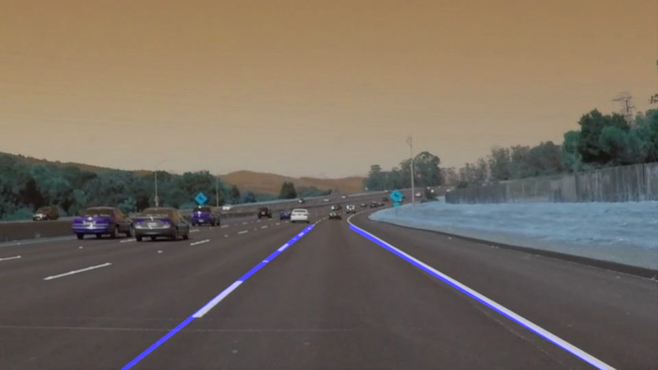

# **Finding Lane Lines on the Road** 

## Writeup Template

### You can use this file as a template for your writeup if you want to submit it as a markdown file. But feel free to use some other method and submit a pdf if you prefer.

---

**Finding Lane Lines on the Road**

The goals / steps of this project are the following:
* Make a pipeline that finds lane lines on the road
* Reflect on your work in a written report

[//]: # (Image References)

[image1]: ./test_images_output/solidWhiteCurve.jpg "solidWhiteCurve.jpg"
[image2]: ./test_images_output/solidWhiteRight.jpg "solidWhiteRight.jpg"
[image3]: ./test_images_output/solidYellowCurve.jpg "solidYellowCurve.jpg"
---

### Reflection

### 1. Describe your pipeline. As part of the description, explain how you modified the draw_lines() function.

My pipeline consisted of 5 steps:
1. Conversion of image to grayscale.
2. Applying gaussian blur with a kernel size of 5.
3. Applying canny edge detection algorithm on the blurred image with appropriate parameters.
4. Applying a mask on the edges image using a polygon of interest.
5. Applying a HoughLinesP function on the masked edges image to identify straight edges. 

In order to draw a single line on the left and right lanes, I modified the draw_lines() function. I classified the lines into two buckets, one with positive slope and other with negative slope. Then I averaged all the lines within each bucket, i.e. I averaged the slope and y-intercept for lines within each bucket. This gave me two averaged lines which I plotted using a thickness of 5.

Some example outputs for the test images are shown below: 

![alt text][image2]
![alt text][image3]

### 2. Identify potential shortcomings with your current pipeline

There are a couple of shortcomings - 
1. Sometimes the line segments which correspond to lane separators further away from the "camera", i.e towards the middle of the image, are not detected well. This is because they are small in size. 
One potential shortcoming would be what would happen when ... 

Another shortcoming could be ...

### 3. Suggest possible improvements to your pipeline

A possible improvement would be to ...

Another potential improvement could be to ...
